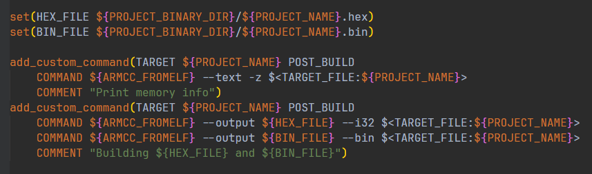

# vscode + cmake + ninja + ARMCC 配置stm32开发环境（构建篇）

## 1. 前置环境

### 1.1 cmake安装
- 从CMake官网上下载CMake安装包进行安装CMake。[CMake官网](https://cmake.org/download/)
 
- 安装完成之后，使用cmd查看cmake是否添加进入环境变量。
 

### 1.2 LLVM套件安装
- 从LLVM的github上下载发布版安装包进行安装LLVM套件。[LLVM](https://github.com/llvm/llvm-project/releases/tag/llvmorg-18.1.8)
  
- 安装完成后，手动添加`clang`到环境变量中。
  
- 使用cmd查看clang是否添加进入环境变量。
  

### 1.3 ninja安装
- 参考ninja安装。[ninja安装](https://blog.csdn.net/qq_36651243/article/details/115689930)
  
### 1.4 vscode插件安装
- 在vscode插件市场中安装以下插件。
  
  <mark>`clangd`插件与`C/C++`插件不能共存，本次配置使用clangd插件，请先禁用`C/C++`插件<mark>

### 1.5 ARMCC
- ARMCC添加到环境变量中。
  

### 1.6 可使用的stm32 mdk工程
- 需要准备一个可以使用的stm32 mdk工程。
- 本教程使用的是自行搭建的工程，也可以使用`stm32cubemx`生成的工程。`stm32cubemx`生成的工程切记选择生成mdk工程。
  
## 2. 配置VScode插件

### 2.1 配置clangd插件
- clang插件齿轮图标左键点击，进入配置界面。
  
- 配置`clangd`在本机的路径。如果之前设置过环境变量，则可以输入`clangd`即可，如果没有设置过环境变量，则需要输入完成的路径
  
- 配置`clangd`参数，最主要的参数就是`--compile_commands-dir`，此参数用于指定生成的`compile-commands.json`文件存放的路径，此文件可以确保函数，文件跳转更加精确。
  

### 2.2 配置CMake Tools插件
- 配置cmake构建生成文件存放的路径
  

## 3. 编写Cmake文件
### 3.1 指定交叉编译工具链
- 在工程文件根目录下，创建`armcc-toolchain.cmake`，用于指定ARMCC工具链的路径
  
- `armcc-toolchain.cmake`内容
  
  此文件只需要修改第一行，armcc的本机路径即可。

### 3.2 `CMakeLists.txt`文件编写
- 在工程文件根目录下，创建`CMakeLists.txt`文件
  
- `CMakeLists.txt`文件内容
  - 常规设置
    
    
    主要设置了cmake最低版本，目标平台，系统名称，CPU类型。<mark>`SYSTEM_NAM`一定要选择`Generic`<mark>。  

  - 工程名设置
    

  - 编译器flag设置
    

  - 头文件路径添加
    

  - 链接选项
    
    其中最重要的就是指定`sct`文件路径，该文件需要先试用keil编译生成一次。
  
  - 源文件路径添加
      

  - 目标文件生成
    

  - hex和bin文件生成
    

### 3.3 `CMakePresets.json`文件编写
- 配置生成ninja
  

## 4. 使用
### 4.1 工具链查找

`CMakeLists.txt`文件在编写过程中进行保存，就会自动进行配置构建，出现上图则表示工具链查找正常。

### 4.2 工程构建

点击下方齿轮，进行编译

上图为编译成功之后的截图，可以看到相关存储占用大小信息。也能看到构建用时3.5s，使用mdk进行工程编译编译，需要1分钟以上。