# vscode + cmake + ninja + ARMCC 配置stm32开发环境（调试篇）

## 1. 前置环境
### 1.1 JLink套件安装
- 从Segger官网上下载Jlink套件安装包进行安装Jlink。[Jlink](https://www.segger.com/downloads/jlink/)
  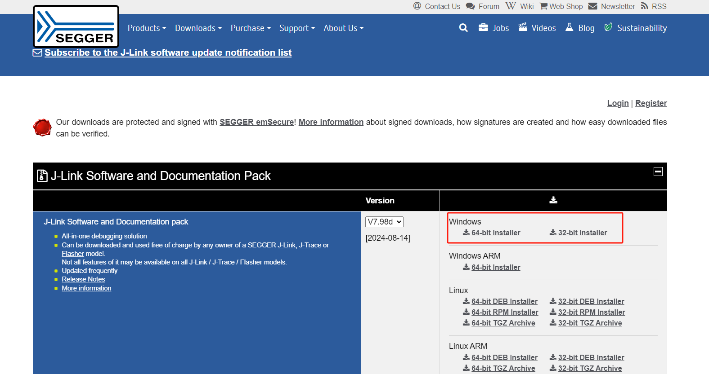

### 1.2 vscode的调试插件安装
- 在vscode插件市场中安装`Cortex-Debug`插件
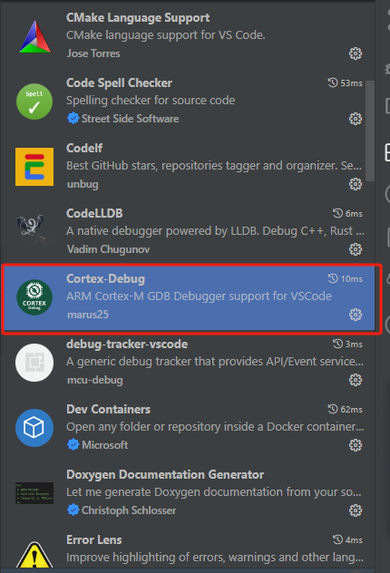
- 进入设置界面，进行`Cortex-debug`插件的配置
  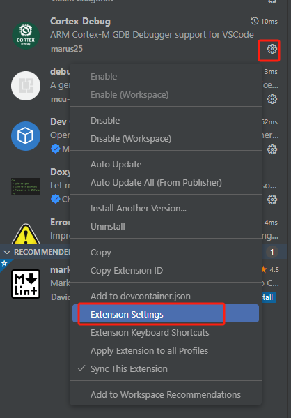
- 设置`Jlink GDBServer`路径 
  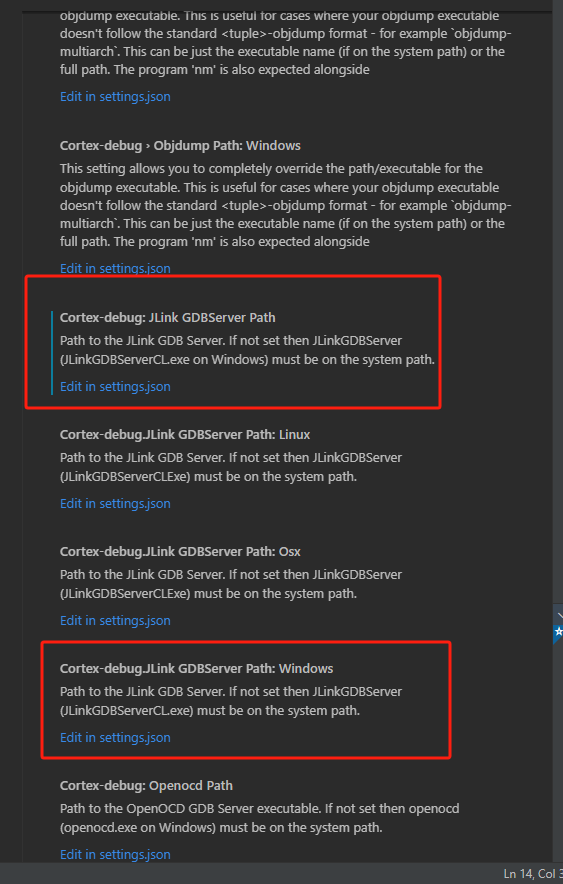 
  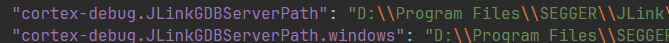  
- 保存修改
  
  
## 2. 编译
- 使用之前[构建篇](https://blog.csdn.net/qq_15301285/article/details/141159657)的工程，在下图的CMake界面就能进行程序的编译。
  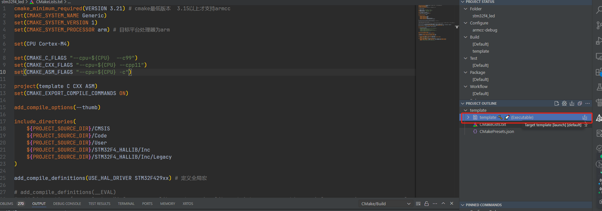

## 3. 调试
- 在debug界面，选择`create a launch.json file`，创建调试文件。
  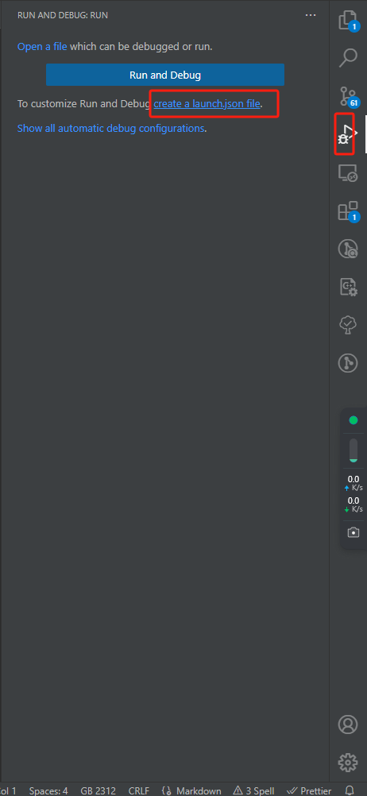
- 在文件中选择`Add Configuration...`
  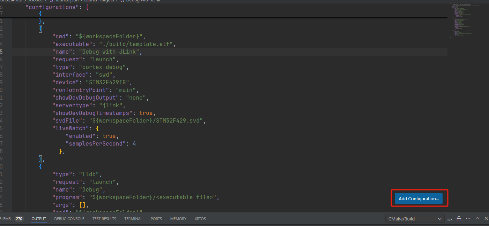
- 在弹出界面选择`Cortex Debug: Jlink`。本文中使用的是`Jlink`进行调试，同样也能使用`stlink`或者`openOCD`。
  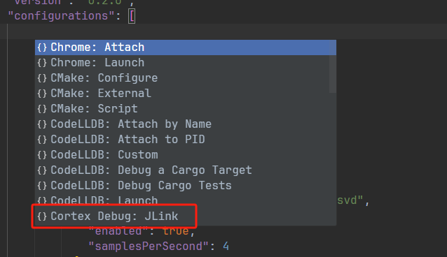
- 在创建出来的模板中进行修改和新增内容。
  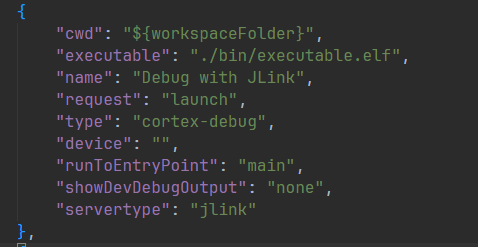
  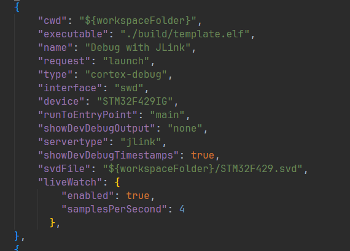
  其中主要有以下几点进行修改和新增。
  - `"executable":`该项目的内容需填写之前编译生成的elf文件所在位置
  - `"interface":`该项目的内容是用于指定调试使用的接口协议，`jtag`或者`swd`
  - `"device":`该项目的内容用于指定调试的MCU型号，`如果在jlink中无法找到自己使用的MCU，必须先添加MCU到Jlink中，才能在这边进行指定`
  - `"svdFile":`该项目内容用于指定svd文件的位置，该文件可以在调试过程中查看寄存器，如果没有此文件，则无法查看寄存器内容
- 修改完成之后，保存，进入debug界面，选择`Debug with JLink`进入调试界面
  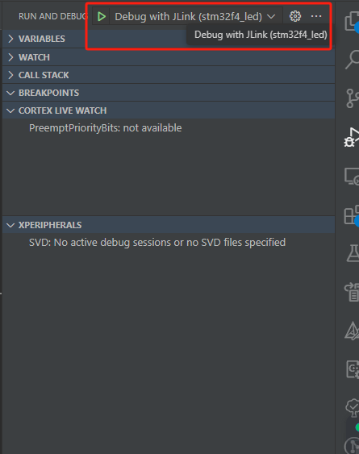
  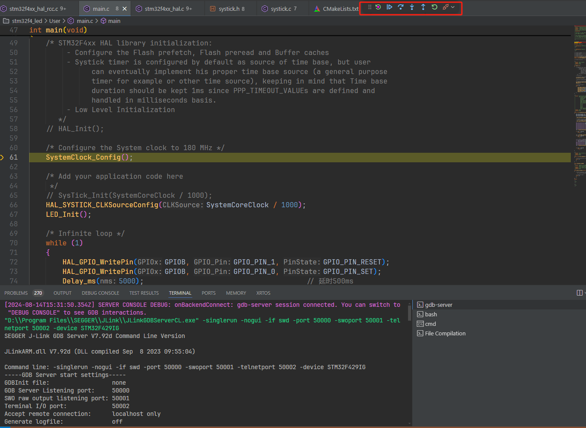